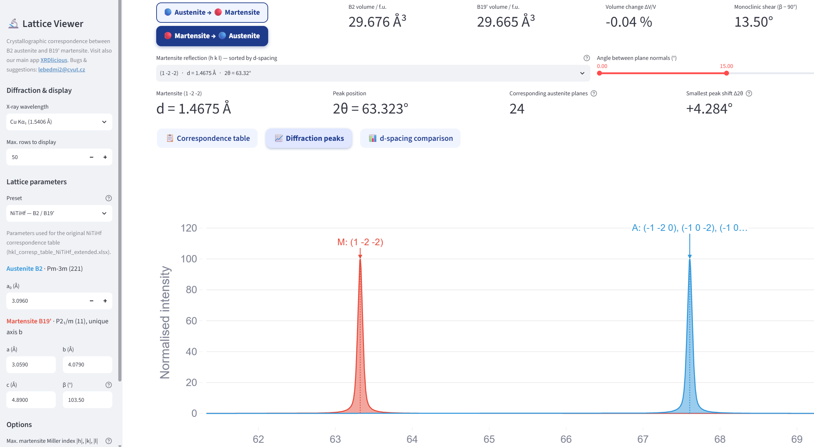

# austenite-martensite

Interactive Streamlit app for the crystallographic correspondence between **B2 austenite** and **B19' martensite** in NiTi-based shape memory alloys (NiTiHf, NiTi).



## Features

- Correspondence of planes in both directions (austenite → martensite and martensite → austenite), computed directly from the lattice parameters
- Presets for NiTiHf and NiTi, or custom lattice parameters (a₀; a, b, c, β)
- d-spacings, 2θ peak positions and peak shifts for common X-ray wavelengths
- Simulated diffraction peaks (Gaussian, Lorentzian, pseudo-Voigt, Pearson VII)
- Volume change and monoclinic shear of the transformation

## Run locally

```bash
git clone https://github.com/bracerino/austenite-martensite.git
cd austenite-martensite
pip install -r requirements.txt
streamlit run app.py
```

## Contact

Bugs and suggestions: lebedmi2@cvut.cz. See also [XRDlicious](https://xrdlicious.com).
